# 🎓 PL/SQL FINAL EXAM — CAPSTONE README  
*(Phase I & Phase II Documentation)*  

---

## 👤 Identification  
- **Name:** MICOMYIZA KANYAMIBWA Ghislaine  
- **Student ID:** 27805  
- **Project Title:** Shadow Intelligence Monitoring & Threat Analysis System  
- **Course:** INSY 8311 – Database Development with PL/SQL  
- **Academic Year:** 2024–2025  
- **Lecturer:** Eric Maniraguha (eric.maniraguha@auca.ac.rw)  

---

## 🚀 Phase I — Problem Statement & Presentation  

### 📌 Objective  
To design an Oracle PL/SQL system that supports a secret intelligence agency in tracking spies, monitoring mission execution, analyzing threat reports, and issuing automated security alerts.

---

## 💡 Project Summary — Shadow Intelligence Unit (SIU)

### 📖 Problem Definition  
The agency lacks an automated system to analyze intelligence, track agent safety, and classify mission risks. Manual tracking causes:
- slow response to dangerous threats,
- lost field updates,
- unreliable spy health status tracking,
- inability to identify mission-risk patterns.

---

### 🌍 Context of Use  
This system will operate in:
- spy headquarters,
- regional operation districts,
- covert monitoring units.

It acts as a centralized data repository for mission intelligence.

---

### 🎯 Target Users  
- Field spies  
- Threat analysts  
- System administrators  
- Security leadership/executives  

---

### 🏆 Core Project Goals  
- Validate and store mission reports  
- Track spy movement and health status  
- Produce automated alerts for critical threats  
- Maintain threat analysis history  
- Support leadership decision-making  

---

## 🧩 Key Database Entities  

### Entity: Spy  
Attributes:  
- spy_id  
- spy_name  
- region  
- status  
- rank  

### Entity: Mission  
Attributes:  
- mission_id  
- mission_title  
- mission_type  
- difficulty  
- mission_status  

### Entity: Intelligence_Report  
Attributes:  
- report_id  
- spy_id  
- mission_id  
- content_summary  
- threat_level  
- report_date  

### Entity: Threat_Analysis  
Attributes:  
- analysis_id  
- report_id  
- analyst_name  
- risk_factor  
- recommended_action  
- analysis_date  

### Entity: Spy_Status_Log  
Attributes:  
- log_id  
- spy_id  
- old_status  
- new_status  
- log_date  

### Entity: Internal_Alert  
Attributes:  
- alert_id  
- report_id  
- alert_message  
- alert_date  

---

## 🔗 Major Relationships  
- One spy submits many reports (1:N)  
- One mission can receive multiple intelligence reports (1:N)  
- Each report has one threat analysis result (1:1)  
- Depending on risk level, a report can generate multiple alerts (1:N)  
- Spy statuses change over time and are logged (1:N)  

---

## 💎 System Benefits  
- Real-time agent status visibility  
- Automatic threat escalation alerts  
- Historical tracking of all risk decisions  
- Clear reporting links between missions and threats  
- Full auditing trail through status logs  

---

# 🧠 System Flow Diagram  


---
## 📘 Phase II: Business Process Modeling (MIS)

### 🔍 Scope & Purpose
This phase models the **intelligence workflow** from field report submission to threat analysis and alert generation.  
It demonstrates how an **MIS supports strategic decision-making** through real-time risk detection, automated alerting, and historical threat traceability.

---

### 👥 Key Actors

| Role                | Responsibility                                                    |
|--------------------|------------------------------------------------------------------|
| Field Spy           | Submits intelligence reports from mission regions                |
| Threat Analyst      | Reviews reports and classifies risk levels                      |
| SIU Intelligence System | Stores reports, evaluates threat severity, triggers alerts     |
| Security Leadership | Receives alerts and responds operationally                      |
| Audit & Status Log Service | Tracks spy status transitions and threat-driven changes     |

---

### 🖼️ Process Diagram

✅ **Tools Used:**  
- **Mermaid** (Lightweight BPMN-style flow)  
- **Draw.io** (Swimlane-based BPMN format)  

---

#### 🔗 Mermaid Diagram  


---

#### 🧩 Draw.io BPMN Diagram  


---

### 🧠 MIS Value & Flow Summary
The diagram begins when a **Field Spy collects mission-based intelligence** and submits a report.  
The system then sends this report to a **Threat Analyst** who evaluates severity and recommends actions.  
If the threat is **High or Critical**, the system automatically generates an alert and notifies leadership.  
Leadership may change mission objectives or modify spy operational status (such as Injured or Compromised).  

The MIS process delivers value by:
- Supporting **real-time operational decision-making**  
- Automating **alert escalation** for severe threats  
- Maintaining **historical risk trails**  
- Capturing **spy status over time through log records**  
- Reducing human delay during threat escalation  

---

### 💻 Mermaid Code Reference

```mermaid
flowchart TD
  start([● Intelligence Lifecycle Start]) --> A1["🕵 Field Spy\nSubmit Report"]
  A1 --> A2["📄 Report Stored"]
  A2 --> B1["🧠 Analyst Review"]

  B1 --> C1["📊 Determine Threat Severity"]
  C1 --> D1{{"🔍 Threat = High or Critical?"}}

  D1 -- Yes --> E1["🚨 Generate Internal Alert"]
  E1 --> F1["🏛 Notify Leadership"]
  F1 --> H1["🔐 Update Spy Status (If Required)"]

  D1 -- No --> G1["✔ Archive as Low-Risk Intelligence"]
  G1 --> finish([✅ Process End])

  H1 --> finish

 

  classDef spy fill:#f8e9a1,stroke:#333;
  classDef analyst fill:#cde3ff,stroke:#333;
  classDef system fill:#ffd1d1,stroke:#333;
  classDef leadership fill:#f3d1ff,stroke:#333;

  class A1 spy
  class B1,C1 analyst
  class D1,E1,F1,G1,H1 system
```


## 🧩 Phase III: Logical Model Design

### 🎯 Objective

This project addresses challenges within strategic intelligence operations such as delayed threat response, untracked spy conditions, missing historical risk logs, and absence of automation in alert generation.  
The logical model designed here is built directly from the real-world security and intelligence needs described in Phase I and the detailed workflow modeled in Phase II.

To design a normalized, constraint-based, relational structure that accurately models spies, missions, intelligence collection, threat evaluations, automated alerting, and status logs.

---

### 🗃️ Entities & Attributes

#### 🕵 Spies

| Attribute    | Type          | Constraint                                           |
|---------------|----------------|-----------------------------------------------------|
| Spy_ID        | NUMBER         | Primary Key (Auto-generated)                        |
| Spy_Name      | VARCHAR(100)   | NOT NULL                                            |
| Region        | VARCHAR(100)   | NULL allowed                                        |
| Rank          | VARCHAR(30)    | CHECK (rank IN ('Junior','Senior','Elite'))         |
| Status        | VARCHAR(30)    | Default 'Active', Controlled by system logic        |
| Created_At    | DATE           | DEFAULT SYSDATE                                     |

---

#### 🎯 Missions

| Attribute      | Type          | Constraint                                                          |
|----------------|---------------|----------------------------------------------------------------------|
| Mission_ID     | NUMBER        | Primary Key (Auto-generated)                                        |
| Mission_Title  | VARCHAR(200)  | NOT NULL                                                            |
| Mission_Type   | VARCHAR(50)   | CHECK (mission_type IN ('Surveillance','Tracking','Retrieval','Infiltration','Recon')) |
| Difficulty     | VARCHAR(20)   | CHECK (difficulty IN ('Low','Medium','High'))                       |
| Mission_Status | VARCHAR(30)   | Default 'Assigned', system-updated                                  |
| Start_Date     | DATE          | NULL allowed                                                        |
| End_Date       | DATE          | NULL allowed                                                        |

---

#### 📄 Intelligence_Report

| Attribute        | Type           | Constraint                                                      |
|------------------|----------------|-----------------------------------------------------------------|
| Report_ID        | NUMBER         | Primary Key (Auto-generated)                                    |
| Spy_ID           | NUMBER         | Foreign Key → Spies                                             |
| Mission_ID       | NUMBER         | Foreign Key → Missions                                          |
| Content_Summary  | VARCHAR(2000)  | NULL allowed                                                    |
| Threat_Level     | VARCHAR(30)    | CHECK (IN ('No threat','Medium','High','Critical'))             |
| Report_Date      | DATE           | DEFAULT SYSDATE                                                 |
| Created_By       | VARCHAR(100)   | Tracks who submitted                                            |

---

#### 🧠 Threat_Analysis

| Attribute           | Type           | Constraint                                                      |
|---------------------|----------------|-----------------------------------------------------------------|
| Analysis_ID         | NUMBER         | Primary Key (Auto-generated)                                    |
| Report_ID           | NUMBER         | Foreign Key → Intelligence_Report                               |
| Analyst_Name        | VARCHAR(100)   | NULL allowed                                                    |
| Risk_Factor         | VARCHAR(30)    | CHECK (IN ('Low','Medium','High'))                              |
| Recommended_Action  | VARCHAR(1000)  | NULL allowed                                                    |
| Analysis_Date       | DATE           | DEFAULT SYSDATE                                                 |

---

#### 🗂 Spy_Status_Log

| Attribute    | Type           | Constraint                                           |
|---------------|----------------|-----------------------------------------------------|
| Log_ID        | NUMBER         | Primary Key (Auto-generated)                        |
| Spy_ID        | NUMBER         | Foreign Key → Spies                                 |
| Old_Status    | VARCHAR(30)    | NULL allowed                                        |
| New_Status    | VARCHAR(30)    | NOT NULL                                            |
| Log_Date      | DATE           | DEFAULT SYSDATE                                     |
| Note          | VARCHAR(1000)  | NULL allowed                                        |

---

#### ⚠ Internal_Alert

| Attribute      | Type           | Constraint                                                          |
|----------------|----------------|----------------------------------------------------------------------|
| Alert_ID       | NUMBER         | Primary Key (Auto-generated)                                        |
| Report_ID      | NUMBER         | Foreign Key → Intelligence_Report                                    |
| Alert_Message  | VARCHAR(2000)  | NOT NULL                                                            |
| Severity       | VARCHAR(30)    | CHECK (IN ('Medium','High','Critical'))                             |
| Alert_Date     | DATE           | DEFAULT SYSDATE                                                     |

---

### 🔄 Relationships & Constraints

- 🕵 **Spies → Intelligence Reports** — *One Spy can submit many reports* (1:N)  
- 🎯 **Missions → Intelligence Reports** — *One Mission can have multiple reports* (1:N)  
- 📄 **Report → Threat Analysis** — *One-to-One*  
- ⚠ **Report → Alerts** — *One Report can generate multiple alerts* (1:N)  
- 🧠 **Spy status changes generate logs** — (1 Spy → Many logs)  

**Data Integrity Enforced Using:**
- Foreign key references  
- CHECK constraints on critical business attributes  
- DEFAULT values for timestamps & system-driven status  
- Auto-generated PK values via sequences  

---

### 📐 Normalization (3NF Verified)

- **1NF** — All fields are atomic and non-duplicated  
- **2NF** — All non-key attributes fully depend on PKs (no partial dependencies)  
- **3NF** — No transitive dependencies  

Examples:
- Threat classification depends solely on the specific report (not on spy or mission)  
- Status logs depend only on Spy_ID, never indirectly  

---

### 🖼️ ERD Diagram

> 🟧 **Visual Placeholder: Logical Model ERD**  
> 👉 *This screenshot illustrates all tables, PK-FK relationships, and system constraints.*


---


``
## 🏗️ Phase IV: Database Creation and Access Setup (via SQL Developer)

### 🎯 Objective

To configure and deploy a dedicated Oracle PL/SQL environment specifically for the Shadow Intelligence Monitoring & Threat Analysis System. SQL Developer was used as the main administrative interface—serving as an alternative to Oracle Enterprise Manager—allowing user provisioning, privilege setup, and schema preparation for Phase V.

---

### 🔐 Task 1: PDB and User Creation (SQL Developer)

A separate Pluggable Database (PDB) environment was created to isolate intelligence-based transactional data, ensuring controlled access, security robustness, and simplified schema deployment.

Using SQL Developer GUI and built-in SQL console, the following configuration was executed.

---

### 🧰 Configuration Summary

| Component             | Value                                             |
|-----------------------|---------------------------------------------------|
| **Tool Used**         | SQL Developer (OEM Alternative)                   |
| **PDB Name**          | `wed_27805_Ghislaine_Intelligence_PDB`            |
| **User Created**      | `ghislaine27805`                                   |
| **Password**          | `ghislaine`                                       |
| **Privileges Granted**| Full DBA privileges and resource permissions      |

---

### 📸 Screenshot: PDB Connection and Setup

> 🖇️ *Placeholder – to be replaced with actual screenshot*  


---

### 📸 Screenshot: User Creation and Assigned Permissions

> 🏛 *Placeholder – to be replaced with actual screenshot*  


---

### 💻 SQL Commands Executed

```sql
ALTER SESSION SET CONTAINER = wed_27805_Ghislaine_Intelligence_PDB;

CREATE USER ghislaine27805 IDENTIFIED BY ghislaine;

GRANT ALL PRIVILEGES TO ghislaine27805;
GRANT CONNECT, RESOURCE TO ghislaine27805;
GRANT SYSDBA TO ghislaine27805;
```
## 🧱 Phase V: Table Implementation and Data Insertion

### 🎯 Objective

To physically implement the database structure derived from the logical model and populate it with realistic test data. This ensures that entity relationships, system workflows, and later PL/SQL logic can be fully validated within a functioning data environment.

---

### 🔨 Step 1: Table Creation

✅ The following tables were created in the schema `wed_27805_Ghislaine_Intelligence_PDB` using SQL Developer:

---

#### 🧱 Table: Spies


---

#### 🧱 Table: Missions


---

#### 🧱 Table: Intelligence_Report


---

#### 🧱 Table: Threat_Analysis

 


---

#### 🧱 Table: Spy_Status_Log


---

#### 🧱 Table: Internal_Alert


---

### 📥 Step 2: Data Insertion

Realistic security and mission-related data were inserted into each table to simulate operations of an intelligence organization.

---

#### 🗃️ Insertion: Spies


---

#### 🗃️ Insertion: Missions


---

#### 🗃️ Insertion: Intelligence Reports


---

#### 🗃️ Insertion: Threat Analysis Records


``
# Phase VI – PL/SQL Programming (Procedures, Functions, Triggers, Packages)
Shadow Intelligence Unit (SIU) – Intelligence Automation Module

---

## 🔧 Objective

Phase VI focuses on implementing the core intelligence-processing logic for the Shadow Intelligence Unit (SIU) using PL/SQL.  
The goal is to automate critical operations inside the database, such as:

- Recording intelligence reports  
- Updating spy status based on threat levels  
- Generating internal alerts for high-risk threats  
- Calculating spy threat scores  
- Encapsulating reusable logic with PL/SQL packages  
- Ensuring reliable and structured intelligence workflows  

This phase ensures that intelligence flows inside SIU are secure, automated, and consistent.

---
``
## 🧱 Database Operations

### 🔁 DML Operations
DML operations were used to manipulate data inside SIU tables:
- `INSERT` for saving new intelligence reports  
- `UPDATE` to modify spy status and last activity times  
- `DELETE` for removing invalid or test records during debugging  

These operations were essential for testing the procedures, triggers, and functions developed in this phase.


---

### 🧩 DDL Operations
DDL commands such as:
- `CREATE`
- `ALTER`
- `DROP`

were used to refine the schema during development.  
For instance, fields like `last_active` and `alert_date` were added to improve automation and reporting accuracy.


---

## 💡 Simple Analytics Problem Statement

> **“Analyze how many HIGH or CRITICAL threat reports each spy has submitted to identify high-risk agents and red-zone regions.”**

This analytical task helps the agency identify:
- Spies working in dangerous zones  
- Missions with recurring hostile activity  
- The intensity of threats a spy encounters  

A window function was used to efficiently compute totals per spy.


---

## 🛠️ PL/SQL Components

Phase VI introduced several PL/SQL elements to automate intelligence flow within SIU.

---

## ✅ Procedure: **record_intelligence_report**

This procedure handles the complete processing of a new intelligence report:
- Inserts a report into the database  
- Updates the spy’s last active timestamp  
- Generates internal alerts for “High” or “Critical” threats  
- Uses a cursor to fetch mission and region information  

This ensures that every intelligence entry is processed consistently and securely.


---

## 🧪 Testing the Procedure

Anonymous blocks were used to test:
- Valid report submission  
- Alert generation  
- Spy activity timestamps  
- Cursor data retrieval  

Testing confirmed that the procedure works correctly under different threat scenarios.


---

## 🔍 Function: **get_spy_threat_score**

This function calculates how many high-risk threats a specific spy has encountered.  
It helps identify:
- Spies in danger  
- High-intensity mission areas  
- Compromised or stressed agents  

The function plays a crucial role in decision-making for reassignment and monitoring.


---

## ⚠️ Trigger: **trg_spy_status_auto**

This trigger automates spy status changes:
- **Critical threat** → status becomes *Compromised*  
- **High threat** → status becomes *Under Review*  

It ensures real-time updates without manual intervention, reducing the risk of oversight during emergencies.


---

## 📦 PL/SQL Package: **siu_intel_pkg**

A PL/SQL package was created to group together SIU intelligence logic:

### Included in the package:
- Procedure: `record_intel`  
- Function: `spy_threat_score`  

### Benefits:
- Centralized intelligence automation
- Cleaner code organization
- Reusable logic across other phases
- Easier maintenance and debugging


---

## 🧪 Package Testing

The package was tested using anonymous PL/SQL blocks.  
Testing confirmed that:
- Intelligence reports are recorded correctly  
- Threat scoring works accurately  
- Automated alerts and spy status updates function as expected  


---

## ✅ End of Phase VI

Phase VI successfully introduced automation and intelligence driven decision making inside the SIU system.  
All PL/SQL components work together to enhance security, accuracy, and operational efficiency within the intelligence workflow.


## 🧠 Phase VII: Advanced Database Programming and Auditing

### 🎯 Objective

To secure the intelligence system by implementing **trigger-based restrictions**, **centralized auditing logic**, and **automated status monitoring** to ensure controlled data access and accountability for all mission-critical modifications.

This phase adds governance and traceability critical to intelligence operations.

---

## 🔍 Problem Statement

Intelligence records and threat analyses represent sensitive information that must not be altered during strategic blackout periods such as:

- Active field operations
- Restricted high-risk periods
- Emergency lockdown dates

To address this, the system implements:

- 🔒 DML blocking based on operation-restricted dates  
- 🕵 Full logging of user actions  
- 🗂 Stored tracking of attempted and executed changes  

This establishes **monitoring integrity**, **audit readiness**, and **preventive access controls**.

---

## 📅 Operation Restriction Calendar

### ✅ `restricted_days` Table

The security office defines certain blackout dates on which intelligence reports cannot be altered.

```sql
CREATE TABLE restricted_days (
    restriction_date DATE PRIMARY KEY,
    reason           VARCHAR2(100)
);

-- Sample restriction periods
INSERT INTO restricted_days VALUES (TO_DATE('2025-01-15','YYYY-MM-DD'), 'High-risk Cross-Border Operation');
INSERT INTO restricted_days VALUES (TO_DATE('2025-02-06','YYYY-MM-DD'), 'Classified Mission Debrief Window');
COMMIT;
